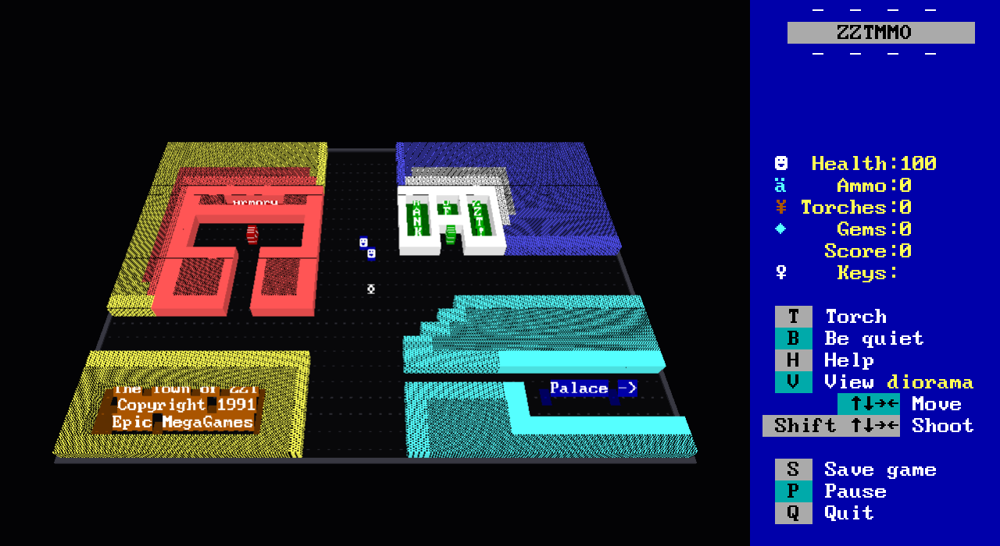
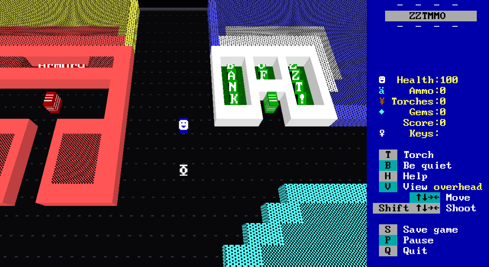
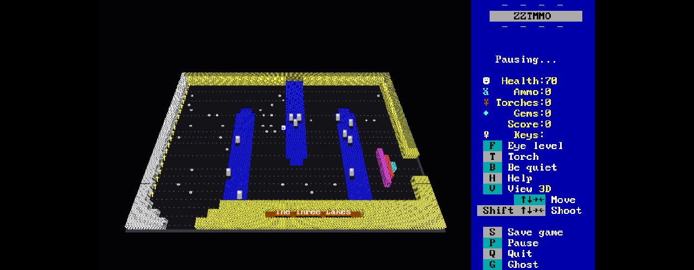
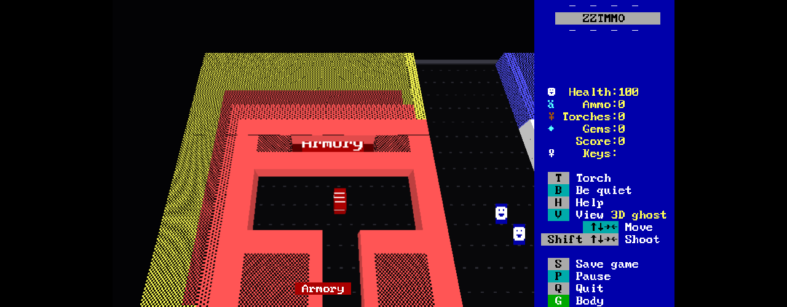
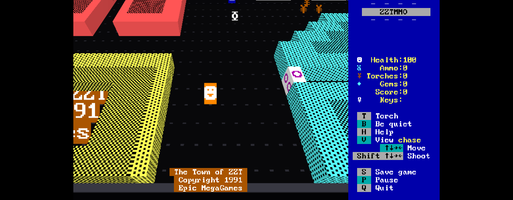
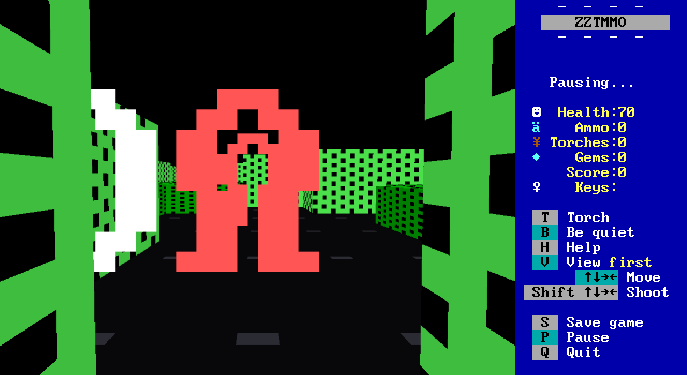
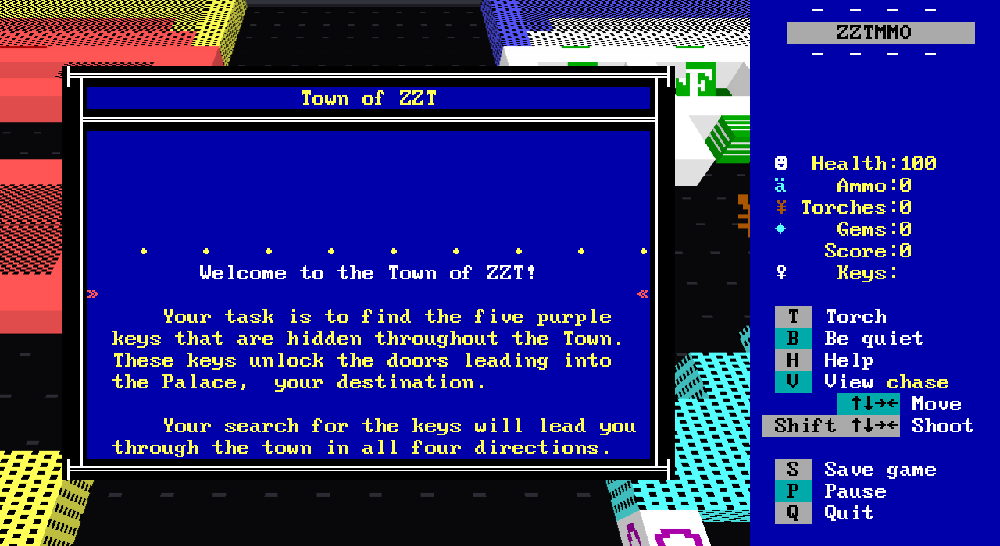

# ZZTMMO 3D

A 3D client for [ZZTMMO](https://github.com/shotintoeternity/zztmmo).



The ZZTMMO server is authoritative and its browser client is a dumb terminal:
it sends keymasks and command bytes, and draws the 60x25 board of CP437 cells
the server streams back. This is a second dumb terminal for the same server.
It speaks the same WebSocket protocol, receives the same cells, and draws them
as a world instead of a text screen. Nothing in the main repository changes,
and the server never learns which client you are using.

Every square becomes what its glyph says it is, at the glyph's true
proportions: a text cell is 8 pixels wide and 14 tall, so a tile is 1 wide and
1.75 deep, a wall is 1.75 tall, and a card is 1 by 1.75, and no glyph is ever
stretched. A `▓` wall is a block with yellow `▓` on every face. A `☻` is a white smiley on a blue card that always
faces you. A fake wall looks exactly like a wall, because it is drawn with the
wall's glyph, which is the joke working. Other players stand on the board as
their own cards, in the color they picked.



## Running it

You need a ZZTMMO server. From a checkout of that repository:

```sh
cd engine
cp ../fixtures/TOWN.ZZT .
go build -o zzt-server ./cmd/zzt-server
./zzt-server -addr 127.0.0.1:8080 -world TOWN -help . -web /path/to/zztmmo-3d/dist
```

Then in this repository:

```sh
npm install
npm run build
open http://127.0.0.1:8080/?world=TOWN&name=You
```

For development, `npm run dev` serves the client on 5173 and proxies `/ws` and
`/api` to a server on 8080, so you can edit and reload against a live game.

Query parameters:

| Parameter | Meaning |
|---|---|
| `world` | The world to join. Default `TOWN`. |
| `name` | Your name on the board. |
| `color` | Your card's background, as `%23RRGGBB`. |
| `board` | The board to start on; the server's default otherwise. |
| `view` | Where the camera starts: `overhead` (the default), `chase`, `first`, `diorama` or `classic`. |

## Playing

The keys are ZZT's. Arrows move, Shift+arrow shoots, and T, P, B, S, Q, H and
`?` do what the sidebar says. Scrolls, help, prompts and the pause label draw as
ZZT's own text windows over the 3D view.

**A** and **D** strafe, in the first-person view only, where they are the one
thing the arrows cannot say: a step sideways without turning. Everywhere else
the arrows are already absolute board directions, so a strafe would mean
nothing and the keys do nothing. They never reach the server as themselves --
the client resolves them against your facing and sends an ordinary direction,
which is all ZZT's six-bit keymask can carry. (**A** sits next to **S**, which
is Save; a WASD reflex opens the save prompt, and Escape closes it.)

**V** switches between the two things this client can be:

- **3D** is the board with depth, on one camera, and it starts where choosing
  it means you want to be: at eye level, standing inside your own square.
  Drag to orbit, wheel to zoom. **F** backs you out to the distance you were
  last watching from and takes you in again; from there, all the way out is the
  whole board from the south, the way the text screen shows it, and part way is
  over your own shoulder.
- **classic** is the regular ZZTMMO screen: the board drawn flat as text.

The client opens on the overhead shot, which is the one view V never returns
to: it is the establishing shot, before you have chosen to be in the board or
to read it. The wheel and F both go back to it.

Overhead, chase and diorama used to be three more modes on this key. They were
never three things -- one camera at three distances, with the wheel already
moving between them -- so they are distances now, and `?view=` still names
them.

**G** leaves your body. See below.

First person is the one that earns being a state rather than an angle, because
the controls change there: left and right turn instead of walking, up walks the
way you face, down walks backwards, A and D step sideways, and Space+up shoots
straight ahead. Zooming in and out across that line lets go of any key you are
holding, so a key held across it cannot mean two things.

### What the glyph cannot say

Every square in this client is read from the byte the server drew there, which
is the whole idea: a wall is a wall because it is drawn with a wall's glyph.
One element defeats that. ZZT has two floor materials, the empty and the
**fake**, and they are the only elements every creature moves through freely --
but `ElementDefs` gives the fake the *normal wall's* character on purpose, so a
fake wall and a real one arrive here as the same two bytes. Most fakes in
practice are floor decoration rather than secret passages, and standing all of
them up as walls made rooms out of open ground.

So the server now names it. `ScreenCell` carries an `element` field, and the
client draws a fake as the pattern it was drawn with, lying down: the exact
colours and glyph of the wall it imitates, as floor you walk over. Everything
else is still inferred from the glyph.

The field says what the screen is *showing*, never what the board is holding
back. A dark room discloses nothing, and neither does an invisible wall, which
draws as a blank until you walk into it. Older servers simply omit the field
and this client behaves exactly as it did before.



### Ghosting

**G** steps out of your body. Your `☻` stays exactly where it was standing --
it is still on the board, and the board is still ticking -- while the camera
drifts off on its own, through walls, into sealed rooms, over the water. The
keys keep whatever meaning the view already gave them: in an orbit view the
arrows are board directions, and in first person left and right still turn
while A and D fly you sideways. G brings you home, and so does V or walking
through a passage, because a ghost is a place on this board.

A ghost is a way of looking and never a way of reaching. The client sends
**nothing at all** while you are out there -- not a single input frame -- which
is why any player can turn it on and it is not a cheat: you cannot open a door,
take a gem, or step past a locked one, because none of you is there to do it.
It also costs something real. The world does not pause while you are away, so
whatever is walking toward the body you left is still walking.

This is the version of ghosting that this client can honestly have. The server
is authoritative and resolves every step, so walking a *player* through a wall
would be a server change, not a client one; the camera, on the other hand, was
always ours. One limit falls out of the same fact: a ghost sees only what the
server already sent, so drifting into an unlit room still shows you the dark.



### Reading, in a world you are standing in

Two kinds of words live on a ZZT board, and in three dimensions they need
reading two different ways.

The **message line** -- what the game writes over the bottom row when you touch
something -- is not part of the board, so it leaves the scene and is written on
the bottom row of the screen, where ZZT puts it, rather than standing up as a
row of cards.

**Signs** are part of the board. They are text elements: walls you can read, and
a board with its signs taken out is not the board, so they stay in the world.
But a sign is a row of letters lying flat across the floor, and from inside the
world, at eye height, a row of letters is edge-on and unreadable -- in first
person a sign is a colored wall and nothing more. So the sign you are standing
at reads itself out just above the message line, in its own colors, and only
that one: walk up to it and it appears, walk away and it is gone. A ghost
reads them too, from wherever it has drifted to, because reading is something
eyes do and a ghost took them with it. Every sign on
the board written out at once would be noise; one sign that arrives as you
reach it is a sign you read.







## How it works

- `src/net.ts` joins, sends input on the key edges and re-sends the held
  keymask every 55ms, exactly as the 2D client does, because the server
  consumes each frame on one 110ms tick.
- `src/classify.ts` turns a glyph and a DOS attribute into a shape: wall,
  short block, forest, water, gate, fog, floor or sprite. It is pure and
  tested.
- `src/scene.ts` rebuilds the board geometry when cells change and draws it
  through one pair of shaders that read the CP437 font atlas: a texel is
  foreground where the glyph has ink and background elsewhere.
- `src/text_runs.ts` finds the board message and the signs in the cells,
  groups a sign's runs into its lines, and answers which sign you are close
  enough to read. Pure and tested.
- `src/input.ts` is the key vocabulary. The strafes are two pseudo-bits above
  the server's six, resolved against your facing or dropped, so they can never
  be sent; it also says which way a held key flies a ghost. Pure and tested.
- `src/zoom.ts` is the single axis the 3D view moves along, and the hysteresis
  that keeps the first-person boundary from flickering. Pure and tested.
- `src/camera.ts` is the two views and the blend between orbit and eye height. `src/overlay.ts`, `src/sidebar.ts`,
  `src/textwindow.ts` and `src/modals.ts` are the 80x25 text layer on top.

`npm test` runs the node suites for the classifier, the key vocabulary, the
text windows, the board text and the zoom axis. `npm run build` type-checks and bundles.

## Not here yet

Sound, chat, the world picker, the editor, watching and replays, and the
challenge course. A reload joins as a new player: resume tokens are not kept. All of those exist in the 2D client, and this one connects
to the same server, so nothing stops them being added.

## Credits

ZZT is Tim Sweeney's. The server and the text-window and sidebar code are
from ZZTMMO; the font sheet is from Adrian Siekierka's Zeta. See NOTICE.md.
