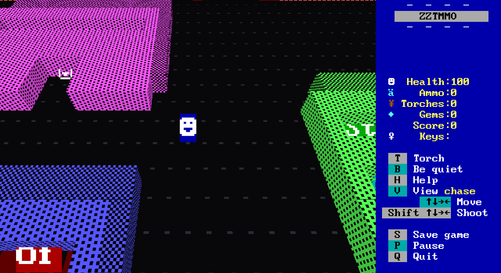

# ZZTMMO 3D

A 3D client for [ZZTMMO](https://github.com/shotintoeternity/zztmmo).


The ZZTMMO server is authoritative and its browser client is a dumb terminal:
it sends keymasks and command bytes, and draws the 60x25 board of CP437 cells
the server streams back. This is a second dumb terminal for the same server.
It speaks the same WebSocket protocol, receives the same cells, and draws them
as a world instead of a text screen. Nothing in the main repository changes,
and the server never learns which client you are using.

Every square becomes what its glyph says it is. A `▓` wall is a block with
yellow `▓` on every face. A `☻` is a white smiley on a blue card that always
faces you. A fake wall looks exactly like a wall, because it is drawn with the
wall's glyph, which is the joke working. Other players stand on the board as
their own cards, in the color they picked.



## Running it

You need a ZZTMMO server. From a checkout of that repository:

```sh
cd engine
cp ../fixtures/TOWN.ZZT .
go build -o zzt-server ./cmd/zzt-server
./zzt-server -addr 127.0.0.1:8080 -world TOWN -help . -web /path/to/zztmmo-3d/dist
```

Then in this repository:

```sh
npm install
npm run build
open http://127.0.0.1:8080/?world=TOWN&name=You
```

For development, `npm run dev` serves the client on 5173 and proxies `/ws` and
`/api` to a server on 8080, so you can edit and reload against a live game.

Query parameters:

| Parameter | Meaning |
|---|---|
| `world` | The world to join. Default `TOWN`. |
| `name` | Your name on the board. |
| `color` | Your card's background, as `%23RRGGBB`. |
| `board` | The board to start on; the server's default otherwise. |
| `view` | `chase`, `first` or `diorama`. |

## Playing

The keys are ZZT's. Arrows move, Shift+arrow shoots, and T, P, B, S, Q, H and
`?` do what the sidebar says. Scrolls, help, prompts and the pause label draw as
ZZT's own text windows over the 3D view.

**V** cycles the camera, which is the one key this client keeps for itself:

- **chase** follows your smiley from behind and above, north up, so the arrows
  still mean what they mean on the text screen. Drag to orbit, wheel to zoom.
- **first** stands inside your square at eye height, facing the way you last
  pushed. Left and right turn; up walks the way you face, down walks backwards,
  and Space+up shoots straight ahead.
- **diorama** shows the whole board from the south, the way the text screen
  does, with depth.


## How it works

- `src/net.ts` joins, sends input on the key edges and re-sends the held
  keymask every 55ms, exactly as the 2D client does, because the server
  consumes each frame on one 110ms tick.
- `src/classify.ts` turns a glyph and a DOS attribute into a shape: wall,
  short block, forest, water, gate, fog, floor or sprite. It is pure and
  tested.
- `src/scene.ts` rebuilds the board geometry when cells change and draws it
  through one pair of shaders that read the CP437 font atlas: a texel is
  foreground where the glyph has ink and background elsewhere.
- `src/camera.ts` is the three views. `src/overlay.ts`, `src/sidebar.ts`,
  `src/textwindow.ts` and `src/modals.ts` are the 80x25 text layer on top.

`npm test` runs the node suites for the classifier, the key vocabulary and the
text windows. `npm run build` type-checks and bundles.

## Not here yet

Sound, chat, the world picker, the editor, watching and replays, and the
challenge course. A reload joins as a new player: resume tokens are not kept. All of those exist in the 2D client, and this one connects
to the same server, so nothing stops them being added.

## Credits

ZZT is Tim Sweeney's. The server and the text-window and sidebar code are
from ZZTMMO; the font sheet is from Adrian Siekierka's Zeta. See NOTICE.md.
