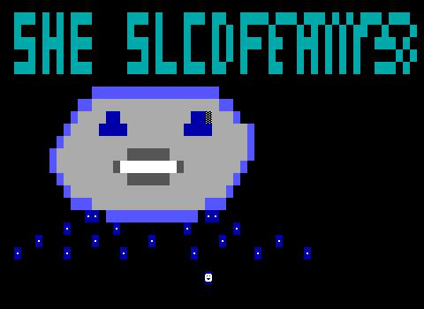
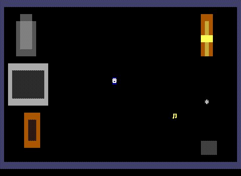
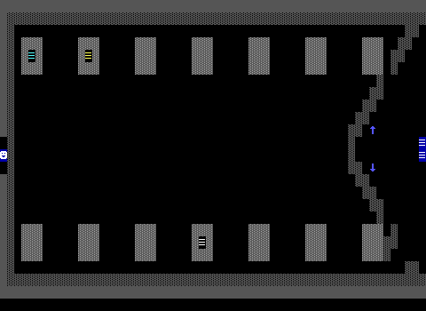

# ZZT generation quality report (M12.17)

Rubric and premise set: `llmworld/EVAL.md`. Scores are 0-5; `n/a` = ungrounded run.

## Summary

| run | world | tier-1 gate | title-legibility | visual-composition | oop-voice | grounding-accuracy |
|---|---|---|---|---|---|---|
| dream-about-slowly-grounded | THESLOWF | **FAIL** (title-wordmark) | 1 | 3 | 5 | 5 |

## dream-about-slowly-grounded

Premise: a dream about slowly forgetting someone you loved

Grounded: true

World: `THESLOWF` (display name "The Slow Forgetting")

### Tier-1 structural gate

| check | result | detail |
|---|---|---|
| compiles | PASS | compiler enforces the ZWD.md Limits table |
| headless-validates | PASS | 200 GameSteps, no panic, no exit request |
| title-wordmark | **FAIL** | no text row spells "The Slow Forgetting" (text rows found: row 18: "\xf9\xf9 \xf9\xf9"; row 19: "\xf9 \xf9 \xf9 \xf9"; row 20: "\xf9 \xf9 \xf9 \xf9 \xf9") |
| title-no-creatures-or-items | PASS |  |
| title-one-player-start | PASS |  |
| reachable-endgame | PASS | #endgame on The Empty Room |
| no-orphan-stat-tiles | PASS |  |

### Judge scores

| dimension | score | justification |
|---|---|---|
| title-legibility | 1 | The wordmark reads 'SHE SLCOFEAIIP3' — garbled and misspelled, not 'The Slow Forgetting'. Letters are inconsistent and half-formed. The large dissolving face is a coherent thematic focal point, and the scattered blue tears below add mood, but the name itself is essentially unreadable, which is the primary criterion. |
| visual-composition | 3 | The bedside board reads as a place with framed furniture (bed, dresser, warm amber lamp, a note glyph) on dark space, matching the 'sharp focus' concept. The hallway is a well-composed repeating corridor of gray doors with a soft-edged seam breaking into the passage on the right — a nice enactment of dream-logic softening. Boards are a bit sparse and dark, but they read as intentional scenes with coherent gray/amber palettes. |
| oop-voice | 5 | Exceptional writing throughout: named objects (lamp, receiver, keeper, theone) with distinct, aching voices. The phone-booth receiver monologue with escalating static (#zap chains), the garden-keeper watching flowers gray in the shape of footprints, and the facewall recall puzzle that gives a torch and #sends gate:open are memorable and mechanically functional. Dialogue lines vary, use #play atmospherically, and drive the grief arc with real craft. |
| grounding-accuracy | 5 | The world faithfully dramatizes its researched grounding: the floating phone booth in clouds with a fading voice matches the visitation-dream imagery cited; the gradual erosion of color/detail across boards enacts the Ebbinghaus forgetting curve; the facewall as the one moment of active recall reflects the 'without reinforcement recall slips' finding; and the bittersweet-not-horror tone matches grief-dream research. Specifics are correct and well-chosen with no fabricated facts presented as real. |

A quietly powerful, emotionally literate world whose OOP writing is genuinely excellent and whose grounding in grief-dream and memory science is both accurate and elegantly translated into mechanics and staging. The gameplay boards are solid corpus-quality scenes with coherent palettes. The one serious weakness is the title screen, whose wordmark is garbled and misspelled to the point of being unreadable despite a striking dissolving-face illustration — a costly flaw for a world named 'The Slow Forgetting.'

