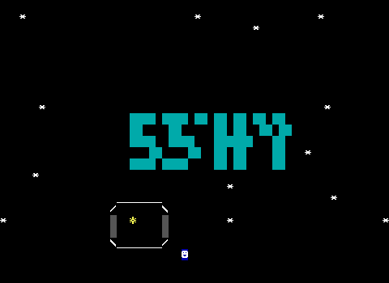
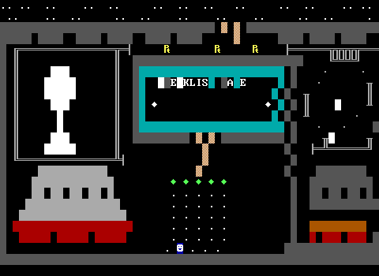
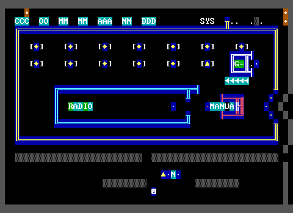
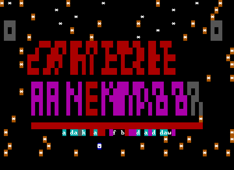
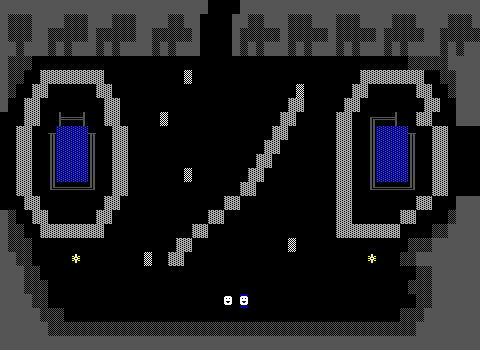
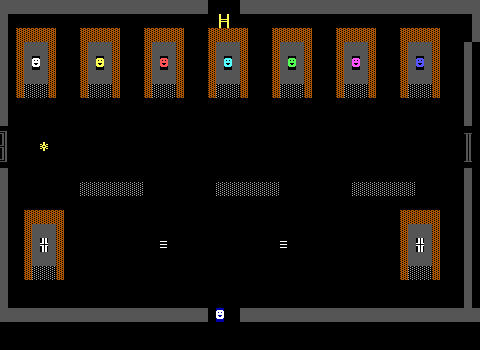
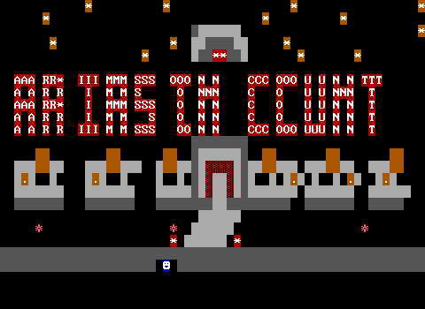
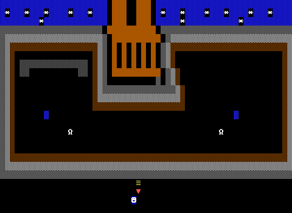
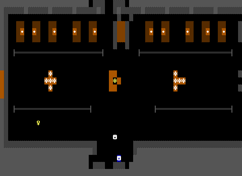

# ZZT generation quality report (M12.17)

Rubric and premise set: `llmworld/EVAL.md`. Scores are 0-5; `n/a` = ungrounded run.

## Summary

| run | world | tier-1 gate | title-legibility | visual-composition | oop-voice | grounding-accuracy |
|---|---|---|---|---|---|---|
| 1969-apollo-moon-plain | APOLLO11 | **FAIL** (title-wordmark) | 0 | 3 | 4 | n/a |
| 1969-apollo-moon-grounded |  | generation failed | — | — | — | — |
| dream-about-slowly-plain |  | generation failed | — | — | — | — |
| dream-about-slowly-grounded |  | generation failed | — | — | — | — |
| classic-haunted-castle-plain | CASTLERA | **FAIL** (title-wordmark, reachable-endgame) | 1 | 3 | 4 | n/a |
| classic-haunted-castle-grounded | CASTLEOF | **FAIL** (title-wordmark) | 2 | 3 | 5 | 5 |

## 1969-apollo-moon-plain

Premise: the 1969 Apollo 11 moon landing, from launch to splashdown

Grounded: false

World: `APOLLO11` (display name "Apollo 11 — Sea of Tranquility")

### Tier-1 structural gate

| check | result | detail |
|---|---|---|
| compiles | PASS | compiler enforces the ZWD.md Limits table |
| headless-validates | PASS | 200 GameSteps, no panic, no exit request |
| title-wordmark | **FAIL** | no text row spells "Apollo 11 — Sea of Tranquility" (text rows found: row 2: "* * *"; row 3: "*"; row 10: "* *") |
| title-no-creatures-or-items | PASS |  |
| title-one-player-start | PASS |  |
| reachable-endgame | PASS | #endgame on Earth Orbit, Pacific Splashdown |
| no-orphan-stat-tiles | PASS |  |

### Judge scores

| dimension | score | justification |
|---|---|---|
| title-legibility | 0 | The title reads 'SSHY' (or similarly garbled) in cyan blocks — the wordmark does not spell 'Apollo Eleven' or any recognizable version of the world name. Letterforms are half-formed and unreadable, so it fails the basic legibility test. The starfield and small capsule below are atmospheric but cannot save a broken wordmark. |
| visual-composition | 3 | The launch pad board (1) is a genuine composed scene: framed viewscreen with a goblet/tower shape, gray Saturn V rocket bases with red exhaust, a gantry with 'R' markers, a teal checklist panel and item gems — reads clearly as a place. The command module board (2) shows a titled 'COLUMBIA' header, a switch panel array, a labeled RADIO and MANUAL, and directional arrows — also a coherent cockpit scene. Solid corpus-quality framing though some text labels are partly obscured/garbled ('EKLIS', 'MANUA'). |
| oop-voice | 4 | Strong writing and real mechanics: Guenter Wendt's 'Guten Morgen, gentlemen' checklist, the ten-switch master-arm gate with a proper #if cascade, decoy breakers ('Coffee warmer. Off.'), a debris-dodge health mechanic, and a timed TLI burn window with a flashing green indicator loop. Named characters (CAPCOM, Guenter, Collins), varied flavor lines, and interactions that gate progression — well above generic boilerplate. |
| grounding-accuracy | n/a | n/a (ungrounded run) |

A well-constructed Apollo world with genuine gameplay mechanics — a ten-switch liftoff gate, debris dodging, and a timed burn window — plus voiced, period-flavored dialogue that clearly exceeds boilerplate. The gameplay boards are composed, framed scenes in the corpus idiom. The fatal weakness is the title screen, whose wordmark is garbled and unreadable ('SSHY'), spelling nothing resembling the world's name. Grounding is not scored for this ungrounded run.

## 1969-apollo-moon-grounded

Premise: the 1969 Apollo 11 moon landing, from launch to splashdown

Grounded: true

**Generation failed:** board "Pacific Splashdown" exhausted 5 generation attempts: Attempt 5 failed: in board "Pacific Splashdown", line 22, col 1: grid uses 1 legend key(s) with no legend entry: ".". Repair only board "Pacific Splashdown" and return only its fenced ZWD board section.

## dream-about-slowly-plain

Premise: a dream about slowly forgetting someone you loved

Grounded: false

**Generation failed:** board "Morning Light" exhausted 5 generation attempts: Attempt 5 failed: in board "Morning Light", line 16, col 37: grid contains 1 stat-backed element(s) with no matching stat: Object at (37, 14). Repair only board "Morning Light" and return only its fenced ZWD board section.

## dream-about-slowly-grounded

Premise: a dream about slowly forgetting someone you loved

Grounded: true

**Generation failed:** Claude API request: Post "https://api.anthropic.com/v1/messages": context deadline exceeded (Client.Timeout exceeded while awaiting headers)

## classic-haunted-castle-plain

Premise: a classic haunted castle adventure with locked doors, a dark dungeon, and a vampire lord

Grounded: false

World: `CASTLERA` (display name "Castle Ravenmoor")

### Tier-1 structural gate

| check | result | detail |
|---|---|---|
| compiles | PASS | compiler enforces the ZWD.md Limits table |
| headless-validates | PASS | 200 GameSteps, no panic, no exit request |
| title-wordmark | **FAIL** | no text row spells "Castle Ravenmoor" (text rows found: row 1: "* * * * * * * *"; row 2: "* * *"; row 3: "* * * *") |
| title-no-creatures-or-items | PASS |  |
| title-one-player-start | PASS |  |
| reachable-endgame | **FAIL** | no #endgame reachable from board 1 (reached boards [1 2 3 4 5 6 7 8 9 10] of 10) |
| no-orphan-stat-tiles | PASS |  |

### Judge scores

| dimension | score | justification |
|---|---|---|
| title-legibility | 1 | The title art is badly broken: the top red band is an illegible jumble of half-formed letters that does not spell CASTLE, and the lower magenta band reads roughly 'RAVENMOOR' but is uneven and cluttered. Scattered orange starbursts and stray objects fill the negative space, and the cyan letter-fragments below add noise. Neither word reads at a glance. |
| visual-composition | 3 | The gate board (1) is a competent symmetric courtyard with framed tomb/coffin alcoves and a decayed floor path. The Great Hall (2) reads clearly as a place: a portrait gallery of colored faces, gray locked doors flanking the room, and a legible layout. Solid corpus-quality shading and structure, though somewhat flat and reliant on repeated fill textures. |
| oop-voice | 4 | Strong atmospheric writing with named characters (Father Halloran, the Twin Heirs, Lady Ravenmoor) and evocative gothic flavor lines. The brass-key portrait object has a real working mechanic with state (#zap touch, #give, latch-release messaging). Marred by a copy-paste bug: the Armory duplicates the Library's ashelf/candelabra/portrait objects verbatim, including the wrong 'library groans/armory latch' text, so the world's key logic is likely broken or confused. |
| grounding-accuracy | n/a | n/a (ungrounded run) |

A fictional haunted-castle world with genuinely atmospheric, character-driven object writing and one properly gated key mechanic, plus two solid, readable gameplay boards. It is dragged down by a broken title screen where the top word is illegible garbage, and by a copy-paste error that duplicates the Library's puzzle objects wholesale into the Armory with mismatched text, undermining the progression spine. Good voice, decent scenes, but sloppy execution keeps it around corpus-average.

## classic-haunted-castle-grounded

Premise: a classic haunted castle adventure with locked doors, a dark dungeon, and a vampire lord

Grounded: true

World: `CASTLEOF` (display name "Castle of the Crimson Count")

### Tier-1 structural gate

| check | result | detail |
|---|---|---|
| compiles | PASS | compiler enforces the ZWD.md Limits table |
| headless-validates | PASS | 200 GameSteps, no panic, no exit request |
| title-wordmark | **FAIL** | no text row spells "Castle of the Crimson Count" (text rows found: row 1: "* * * *"; row 2: "* * *"; row 3: "*") |
| title-no-creatures-or-items | PASS |  |
| title-one-player-start | PASS |  |
| reachable-endgame | PASS | #endgame on Broken Battlements |
| no-orphan-stat-tiles | PASS |  |

### Judge scores

| dimension | score | justification |
|---|---|---|
| title-legibility | 2 | The title spells out the world name in two lines: 'AR*I MMSS OONN CCC OOO UU NN TTT' — an attempt at what reads roughly as the second half of the name. The letters are uneven, some are asterisk-corrupted (AAA RR*), and the wordmark is broken into cramped multi-word rows rather than one clean monumental band. The gray gatehouse/tomb structures below are a coherent motif, but the letters do not read as the full title 'Castle of the Crimson Count' at a glance and contain stray glyphs. |
| visual-composition | 3 | Board 1 (Great Gate) reads clearly as a courtyard scene: a blue starry sky band, a large brown iron portcullis focal point, gray stone walls framing a dark courtyard, and the omega wolf sprites. Board 2 (Grand Hall) is a solid composed hub with a lit candelabra gallery up top, gray-framed bars, torch/candelabra clusters, and a visible key object — clearly a place with structure and shading. Solid corpus-quality rooms though somewhat symmetrical/repetitive. |
| oop-voice | 5 | Excellent, atmospheric writing with strong gothic voice. The Ghost Steward has memorable personality ('The Count considers it untidy'), the altar carves a genuine three-weaknesses riddle ('THE CROSS, THE FLAME, AND THE COMING SUN'), the reading-clerk ghost gives a real puzzle clue in-character, and the font/stake blessing mechanic actually works with #give, #zap, and branching :ask menus. Varied lines, named characters, functional item-gating mechanics tied to the progression spine. |
| grounding-accuracy | 5 | Grounding is accurate and well-chosen: Carpathian/Transylvanian setting, cliffside keep, vampire weaknesses (stake, holy water, garlic, sunlight/dawn), and the plan's notes correctly distinguish Stoker's sunlight-avoidance from the Nosferatu (1922) fatal-sunlight popularization, and correctly associates Vlad the Impaler and Bran Castle as the real-world marketing site. The Latin tome title and the dawn-triggered defeat all fit the lore without fabricated specifics presented as fact. |

A strong gothic ZZT world with genuinely excellent, atmospheric OOP writing and accurate, thoughtfully deployed vampire-lore grounding. The gameplay boards are solid composed scenes with coherent gray-stone palettes, framed structures, and clear focal points. The main weakness is the title screen, whose wordmark is broken, uneven, and contains corrupted glyphs, failing to spell the full name legibly. Overall this reads as a polished, above-corpus-norm haunted-castle adventure held back only by its title art.

